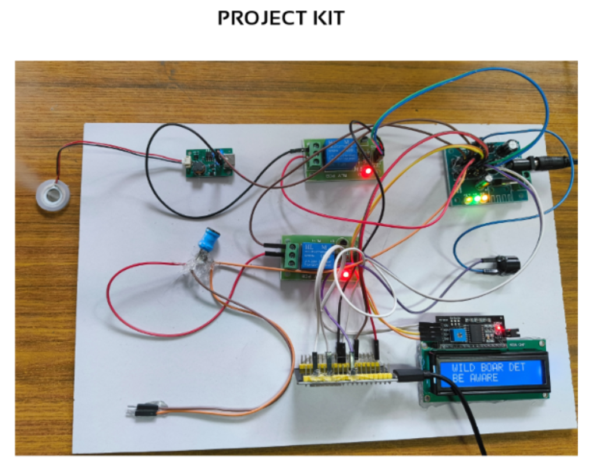
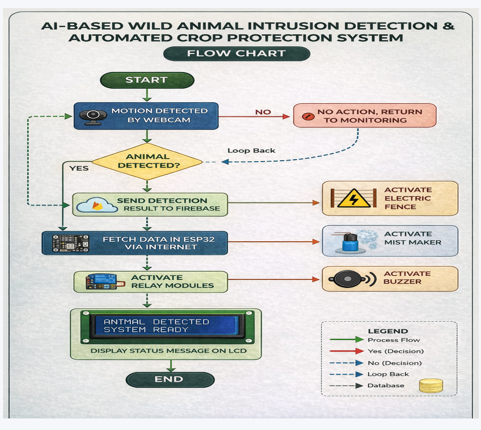
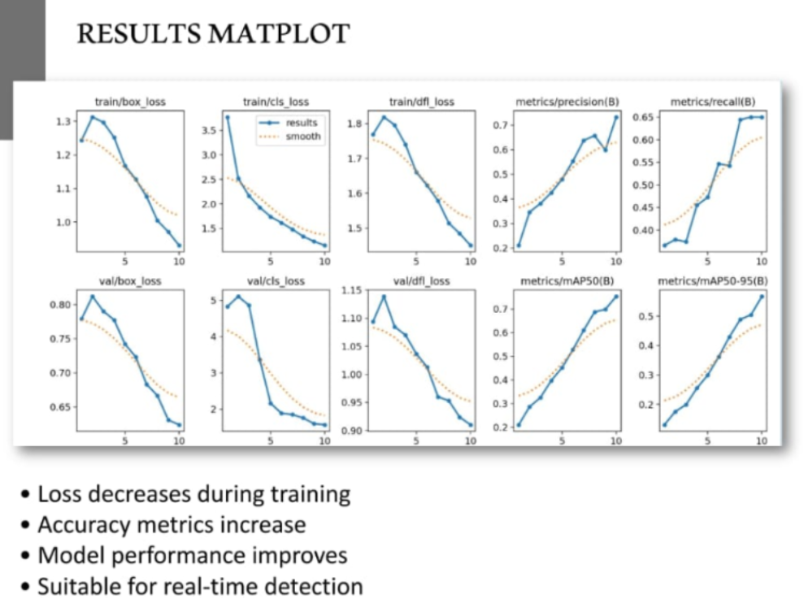
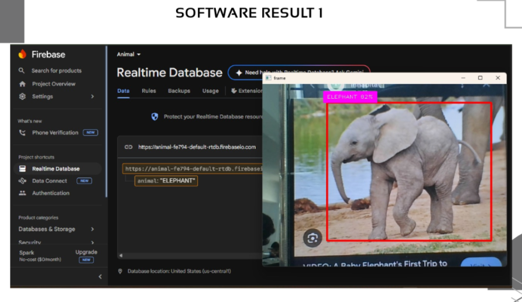
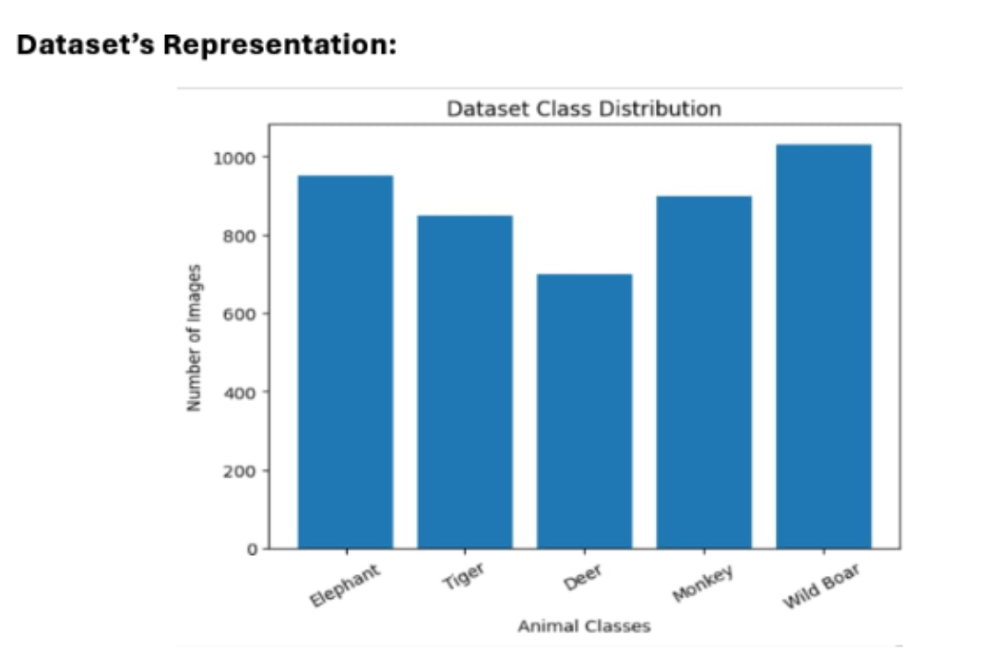

# AI-Based Wild Animal Intrusion Detection and Automated Crop Protection System

## Overview
This project is an AI-powered crop protection system designed to detect wild animal intrusion in agricultural fields and automatically activate deterrent mechanisms.

The system uses YOLOv8-based object detection, IoT communication, and edge computing to provide real-time monitoring and protection for farmers.

## Features
- Real-time wild animal detection
- YOLOv8 AI model deployment
- ESP32-based control system
- Raspberry Pi and NVIDIA Jetson Nano integration
- Firebase cloud monitoring
- MQTT communication
- GSM alert notifications
- Solar-powered electric fencing
- Multi-sensory deterrent activation

## Technologies Used
- YOLOv8
- TensorFlow Lite
- ESP32
- Raspberry Pi
- NVIDIA Jetson Nano
- Firebase Realtime Database
- MQTT
- Django
- OpenCV

## Supported Animal Detection
- Elephant
- Tiger
- Deer
- Monkey
- Wild Boar
- Bear

## Performance
- Precision: 0.71
- Recall: 0.65
- mAP@50: 0.74
- mAP@50-95: 0.51

## Conference Publication
This project was accepted and presented at:

ICRIT'26 – Second International Conference on Recent Innovation in Technologies (2026)

## Author
Mohamed Ibrahim Moosha M

B.E. Electrical and Electronics Engineering

University VOC College of Engineering, Thoothukudi
## Project Images

### Hardware Setup

### Logic Flowchart

### AI Model Performance

### YOLO Detection Result

### Dataset Overview

